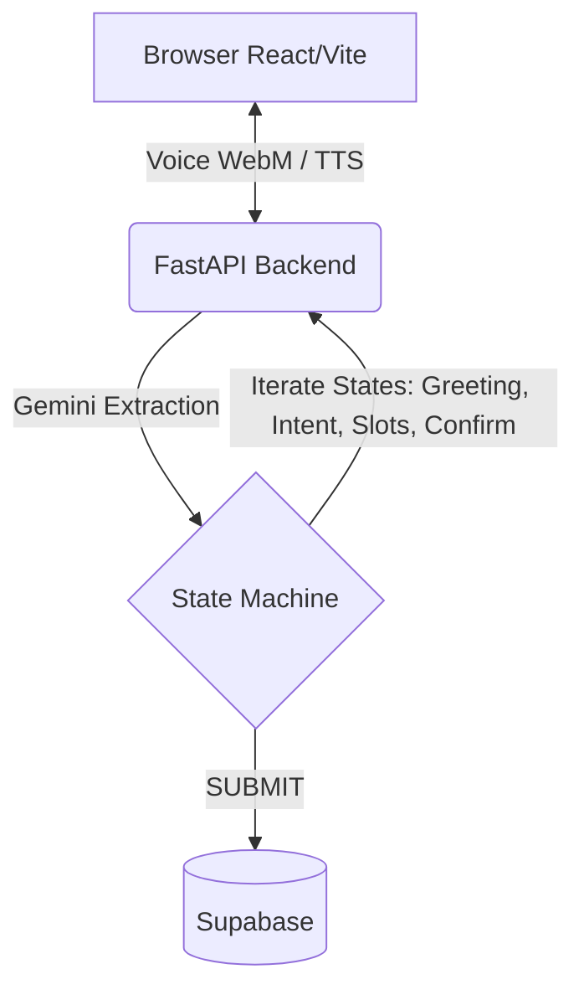

# 🎙️ JustSpeak (ஒன்று பேசு)

> ***Voice-first Tamil digital literacy agent for old-age pension applications.***
> Zero reading or typing required — an end-to-end voice-only accessible interface.


## 💡 The Problem
In rural parts of Tamil Nadu, many elderly citizens who are eligible for the Old-Age Pension (OAP) scheme face a major barrier: **digital illiteracy**. Most online government portals require reading complex forms, typing in English, and navigating difficult UI/UX. This leaves them dependent on middlemen.

## 🚀 Our Solution
**JustSpeak (ஒன்று பேசு)** is a revolutionary web application that entirely replaces the traditional form with an interactive, voice-only AI agent.
- 🗣️ **Zero Typing:** Speak natively in Tamil (or English).
- 🧠 **Smart Extraction:** Powered by Google Gemini to extract slots (Name, Age, Aadhar, etc.) directly from casual speech.
- 🔄 **Mishear Recovery:** If the AI is unsure (low confidence), it gracefully asks for clarification.
- 🔊 **Full Voice Output:** The agent speaks back in Tamil using TTS, keeping the user informed at every step.

## 🛠️ Tech Stack
- **Frontend:** React.js, Vite, TailwindCSS, Framer Motion, Three.js (for immersive voice visuals)
- **Backend:** Python, FastAPI, Playwright (for mock portal automation)
- **AI & NLP:** Google Gemini (STT, TTS, and Slot Extraction)
- **Database:** Supabase (PostgreSQL)

---

## ⚙️ Architecture & Flow



### 🧠 State Machine
The backend orchestrates the conversation through a strict state machine:
1. `GREETING` → Welcomes the user in Tamil.
2. `INTENT_CAPTURE` → Confirms they want to apply for the pension.
3. `SLOT_FILLING` → Collects 8 crucial fields one at a time (Name, Age, Address, Aadhar, etc.).
4. `CONFIRMATION` → Reads back the collected data for voice correction.
5. `SUBMIT` → Saves to Supabase and speaks the reference number.

---

## 💻 Local Development Setup

### 1. Prerequisites
- Node.js (v18+)
- Python (3.10+)
- Supabase Account
- Google Gemini API Key

### 2. Database Setup (Supabase)
1. Create a new project on [Supabase](https://supabase.com).
2. Go to **SQL Editor** → **New Query**.
3. Paste the contents of `backend/supabase_schema.sql` and click **Run**.
4. Retrieve your `Project URL` and `anon key` from Project Settings → API.

### 3. Backend Setup
```bash
cd backend
cp .env.example .env
# Edit .env with your GEMINI_API_KEY, SUPABASE_URL, and SUPABASE_KEY

# Install dependencies
pip install -r requirements.txt

# (Optional) Install Playwright browsers if using automation features
playwright install chromium

# Run the server
uvicorn main:app --reload
```
> The backend will be running at `http://localhost:8000` (API Docs at `/docs`).

### 4. Frontend Setup
```bash
cd frontend
# Install dependencies
npm install

# Start the dev server
npm run dev
```
> The frontend will be running at `http://localhost:5173`.
> **Pro Tip:** Press **Ctrl+D** in the frontend to open the hidden Judges Debug Panel!

---

## ☁️ Deployment Instructions

### Backend (Render Free Tier)
1. Connect your GitHub repo to [Render](https://render.com).
2. Create **New Web Service** and select your repository.
3. Configure as follows:
   - **Root Directory:** `backend`
   - **Environment:** `Python 3`
   - **Build Command:** `pip install -r requirements.txt && playwright install chromium`
   - **Start Command:** `uvicorn main:app --host 0.0.0.0 --port $PORT`
4. Under **Environment Variables**, add:
   - `GEMINI_API_KEY`: *(your gemini key)*
   - `SUPABASE_URL`: *(your supabase URL)*
   - `SUPABASE_KEY`: *(your supabase key)*
   - `PYTHON_VERSION`: `3.11.0`
   - `FRONTEND_ORIGIN`: Your deployed frontend URL (e.g., `https://justspeak.vercel.app`)
5. Click **Create Web Service**.

### Frontend (Vercel)
1. Import your repository at [Vercel](https://vercel.com).
2. Set the **Root Directory** to `frontend`.
3. Under **Environment Variables**, add:
   - `VITE_API_URL`: Your deployed Render backend URL (e.g., `https://justspeak-backend.onrender.com`) - *Make sure there is no trailing slash!*
4. Click **Deploy**.

---

## 🔮 Future Scope
- Expand language support to more regional Indian languages (Hindi, Telugu, Malayalam).
- Deep integration with real government e-Sevai portal APIs.
- WhatsApp voice bot integration to completely bypass the need for a web browser.

---
...
